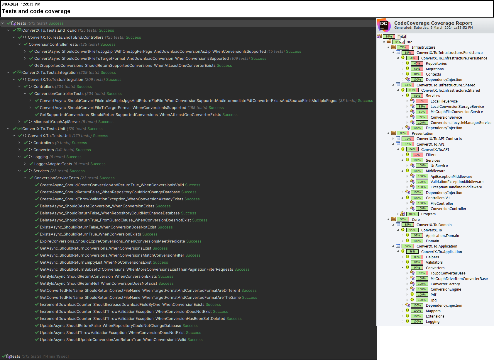

This is a file conversion service I built a year ago as a learning project in an attempt to solidify knowledge after taking quite a few C# courses -- Pluralsight (design patterns, SOLID, clean code, clean architecture) [Nick Chapsas](https://www.youtube.com/@nickchapsas)/[Dometrain](https://dometrain.com/courses/) ([unit testing](https://dometrain.com/course/from-zero-to-hero-unit-testing-in-c/) and [integration testing](https://dometrain.com/course/from-zero-to-hero-integration-testing-in-asp-net-core/)).

```csharp
// ConvertX.To.API.Controllers.V1.ConversionController
[HttpGet("/api/v1/convert")] 
public IActionResult GetSupportedConversions()
    
[HttpPost("/api/v1/convert/{targetFormat}")] 
[Consumes("multipart/form-data", )]
[RequestSizeLimit(50000000L)] 
public Task<IActionResult> ConvertAsync([FromRoute] string targetFormat, [FromForm] IFormFile file, [FromQuery] ConversionOptionsQuery conversionOptionsQuery)
    
// ConvertX.To.API.Controllers.V1.FileController
[HttpGet("/api/v1/file/{conversionId}")] 
public Task<IActionResult> GetFileAsync([FromRoute] Guid conversionId)
    
[HttpDelete("/api/v1/file/{conversionId}")] 
public Task<IActionResult> DeleteFileAsync([FromRoute] Guid conversionId)
```

The Core of the application (src/Core/ConvertX.To.Application) is the ConversionEngine and ConverterFactory.

```csharp
public interface IConversionEngine
{
    Task<(string, Stream)> ConvertAsync(string sourceFormat, string targetFormat, Stream source, ConversionOptions conversionOptions);
}

public interface IConverterFactory
{
    IConverter Create(string sourceFormat, string targetFormat);
}
```

The converters are implemented using [Microsoft Graph](https://learn.microsoft.com/en-us/graph/api/driveitem-get-content-format?view=graph-rest-beta&tabs=http) but I wanted to architect the solution in a way that the implementation of particular conversion could be swapped out very easily. The converters need to implement the IConverter interface with a specific naming convention such as DocxToPdfConverter.

```csharp
public interface IConverter
{
    Task<(string, Stream)> ConvertAsync(Stream source, ConversionOptions conversionOptions);
}
```

The conversion engine has a static method that uses reflection to advertise converters implementing the IConverter interface.

```csharp
public static SupportedConversions GetSupportedConversions()
{
    var convertersByTargetFormat = new Dictionary<string, List<string>>();
    var convertersBySourceFormat = new Dictionary<string, List<string>>();

    foreach (var converter in
             ReflectionHelper.GetConcreteTypesInAssembly<IConverter>(Assembly.GetExecutingAssembly()))
        MapSupportedConversionsForConverter(converter, convertersByTargetFormat, convertersBySourceFormat);

    return new SupportedConversions
    {
        TargetFormatFrom = convertersByTargetFormat,
        SourceFormatTo = convertersBySourceFormat
    };
}
```

```json
// GET /api/v1/convert
// Uses reflection via ConversionEngine.GetSupportedConversions() to determine which file formats from and to are supported by the ConversionEngine.
// NOTE: The beta Microsoft Graph 'Download file in another format' (https://learn.microsoft.com/en-us/graph/api/driveitem-get-content-format?view=graph-rest-beta&tabs=http) 
// from mid-2022 when I wrote this supported more conversions than it does today

{
  "targetFormatFrom": {
    "pdf": [
      "doc",
      "docx",
      "eml",
      "epub",
      "html",
      "htm",
      "md",
      "msg",
      "odp",
      "ods",
      "odt",
      "pps",
      "ppsx",
      "ppt",
      "pptx",
      "rtf",
      "tiff",
      "tif",
      "xlsm",
      "xls",
      "xlsx"
    ],
    "jpg": [
      "ai",
      "arw",
      "asf",
      "avi",
      "bash",
      "bas",
      "bat",
      "bmp",
      "cbl",
      "cmd",
      "cpp",
      "cr2",
      "crw",
      "css",
      "cs",
      "csv",
      "c",
      "cur",
      "dng",
      "doc",
      "docx",
      "dwg",
      "eml",
      "epub",
      "fbx",
      "fppx",
      "gif",
      "glb",
      "heic",
      "heif",
      "html",
      "htm",
      "h",
      "icon",
      "ico",
      "java",
      "jfif",
      "json",
      "js",
      "key",
      "log",
      "m4v",
      "markdown",
      "md",
      "mef",
      "mov",
      "mp4",
      "mrw",
      "msg",
      "nef",
      "nrw",
      "numbers",
      "obj",
      "odp",
      "odt",
      "orf",
      "pages",
      "pdf",
      "pef",
      "php",
      "pict",
      "pl",
      "ply",
      "png",
      "potm",
      "pot",
      "potx",
      "pps",
      "ppsx",
      "pptm",
      "ppt",
      "pptx",
      "ps1",
      "psb",
      "psd",
      "py",
      "raw",
      "rb",
      "rtf",
      "sh",
      "sketch",
      "sql",
      "sr2",
      "stl",
      "tiff",
      "tif",
      "txt",
      "vb",
      "wmv",
      "xaml",
      "xbm",
      "xcf",
      "xd",
      "xpm",
      "yaml",
      "yml"
    ]
  },
  "sourceFormatTo": {
    "doc": [
      "pdf",
      "jpg"
    ],
    "docx": [
      "pdf",
      "jpg"
    ],
    "eml": [
      "pdf",
      "jpg"
    ],
    "epub": [
      "pdf",
      "jpg"
    ],
    "html": [
      "pdf",
      "jpg"
    ],
    "htm": [
      "pdf",
      "jpg"
    ],
    "md": [
      "pdf",
      "jpg"
    ],
    "msg": [
      "pdf",
      "jpg"
    ],
    "odp": [
      "pdf",
      "jpg"
    ],
    "ods": [
      "pdf"
    ],
    "odt": [
      "pdf",
      "jpg"
    ],
    "pps": [
      "pdf",
      "jpg"
    ],
    "ppsx": [
      "pdf",
      "jpg"
    ],
    "ppt": [
      "pdf",
      "jpg"
    ],
    "pptx": [
      "pdf",
      "jpg"
    ],
    "rtf": [
      "pdf",
      "jpg"
    ],
    "tiff": [
      "pdf",
      "jpg"
    ],
    "tif": [
      "pdf",
      "jpg"
    ],
    "xlsm": [
      "pdf"
    ],
    "xls": [
      "pdf"
    ],
    "xlsx": [
      "pdf"
    ],
    "ai": [
      "jpg"
    ],
    "arw": [
      "jpg"
    ],
    "asf": [
      "jpg"
    ],
    "avi": [
      "jpg"
    ],
    "bash": [
      "jpg"
    ],
    "bas": [
      "jpg"
    ],
    "bat": [
      "jpg"
    ],
    "bmp": [
      "jpg"
    ],
    "cbl": [
      "jpg"
    ],
    "cmd": [
      "jpg"
    ],
    "cpp": [
      "jpg"
    ],
    "cr2": [
      "jpg"
    ],
    "crw": [
      "jpg"
    ],
    "css": [
      "jpg"
    ],
    "cs": [
      "jpg"
    ],
    "csv": [
      "jpg"
    ],
    "c": [
      "jpg"
    ],
    "cur": [
      "jpg"
    ],
    "dng": [
      "jpg"
    ],
    "dwg": [
      "jpg"
    ],
    "fbx": [
      "jpg"
    ],
    "fppx": [
      "jpg"
    ],
    "gif": [
      "jpg"
    ],
    "glb": [
      "jpg"
    ],
    "heic": [
      "jpg"
    ],
    "heif": [
      "jpg"
    ],
    "h": [
      "jpg"
    ],
    "icon": [
      "jpg"
    ],
    "ico": [
      "jpg"
    ],
    "java": [
      "jpg"
    ],
    "jfif": [
      "jpg"
    ],
    "json": [
      "jpg"
    ],
    "js": [
      "jpg"
    ],
    "key": [
      "jpg"
    ],
    "log": [
      "jpg"
    ],
    "m4v": [
      "jpg"
    ],
    "markdown": [
      "jpg"
    ],
    "mef": [
      "jpg"
    ],
    "mov": [
      "jpg"
    ],
    "mp4": [
      "jpg"
    ],
    "mrw": [
      "jpg"
    ],
    "nef": [
      "jpg"
    ],
    "nrw": [
      "jpg"
    ],
    "numbers": [
      "jpg"
    ],
    "obj": [
      "jpg"
    ],
    "orf": [
      "jpg"
    ],
    "pages": [
      "jpg"
    ],
    "pdf": [
      "jpg"
    ],
    "pef": [
      "jpg"
    ],
    "php": [
      "jpg"
    ],
    "pict": [
      "jpg"
    ],
    "pl": [
      "jpg"
    ],
    "ply": [
      "jpg"
    ],
    "png": [
      "jpg"
    ],
    "potm": [
      "jpg"
    ],
    "pot": [
      "jpg"
    ],
    "potx": [
      "jpg"
    ],
    "pptm": [
      "jpg"
    ],
    "ps1": [
      "jpg"
    ],
    "psb": [
      "jpg"
    ],
    "psd": [
      "jpg"
    ],
    "py": [
      "jpg"
    ],
    "raw": [
      "jpg"
    ],
    "rb": [
      "jpg"
    ],
    "sh": [
      "jpg"
    ],
    "sketch": [
      "jpg"
    ],
    "sql": [
      "jpg"
    ],
    "sr2": [
      "jpg"
    ],
    "stl": [
      "jpg"
    ],
    "txt": [
      "jpg"
    ],
    "vb": [
      "jpg"
    ],
    "wmv": [
      "jpg"
    ],
    "xaml": [
      "jpg"
    ],
    "xbm": [
      "jpg"
    ],
    "xcf": [
      "jpg"
    ],
    "xd": [
      "jpg"
    ],
    "xpm": [
      "jpg"
    ],
    "yaml": [
      "jpg"
    ],
    "yml": [
      "jpg"
    ]
  }
}

```

By using clean architecture the application can be used via a traditional API (src/Presentation/ConvertX.To.API) or directly within a console application (src/Presentation/ConvertX.To.ConsoleUI.Core). 


The console application will recursively convert all files within a folder to all supported destination file types. There is also another console application (src/Presentation/ConvertX.To.ConsoleUI.API) which does the same but uses the ConvertX.To.API to do the conversion for it.

ConvertX.To.ConsoleUI.Core in action:


A user can convert multi-page documents (e.g. PDFs, Word documents) to ZIP files containing one jpg per page by passing in the ``splitjpg=true`` flag to the jpg converter. 

The conversion engine will use reflection to determine if the source format has a PDF destination converter to do this. Otherwise it will just return the first page as a JPG (the default Microsoft Graph behaviour).

For example, if user uploads a 10 page DOCX file to ``POST /api/v1/convert/jpg?splitjpg=true`` the engine will:
1. Check there is a DocxToPdfConverter (there is)
2. Convert the DOCX to PDF
3. Split the PDF with [PDFsharp](http://www.pdfsharp.com/PDFsharp/) into 10 individual PDF files
4. Convert each PDF file to JPG using the PdfToJpgConverter (which uses Microsoft Graph)
5. Once all pages have been converted, ZIP contents and return to user


The API stores anonymized usage data for service improvement and analytics. 

Screenshot below also highlights the usage of [Hangfire](https://www.hangfire.io/) to regularly clean up user-submitted file conversions from the server.


One of the focuses of this project was getting more comfortable with unit and integration testing as taught by [Nick Chapsas](https://dometrain.com/courses/) and this project has 82% coverage (96% in core) spread across 191 unit + 220 integration tests.

Unit testing stack:
- XUnit
- Bogus
- NSubstitute
- FluentAssertions

Integration testing stack:
- XUnit
- Bogus
- FluentAssertions
- WireMock.NET (to mock Microsoft Graph API)
- Testcontainers & FluentDocker to spin up new postgres database per test run





